## 部署远程

### 百度云

#### 选择云服务器BBC


#### 点击安全组

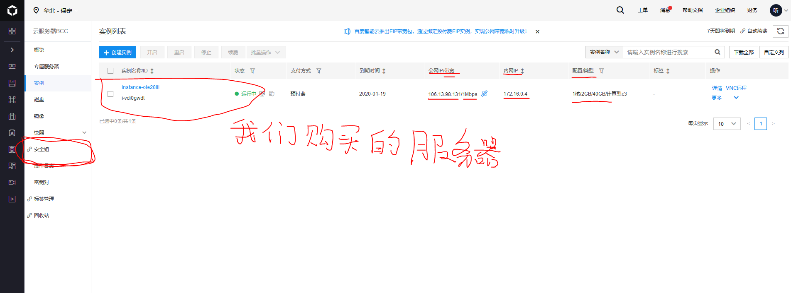

#### 创建安全组

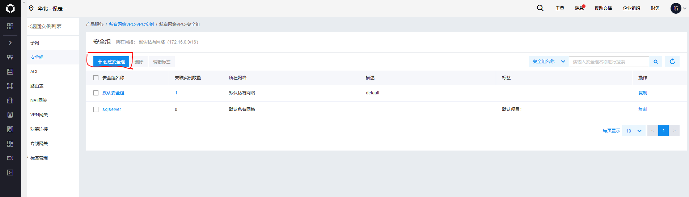

#### 填好安全组名称，新建规则

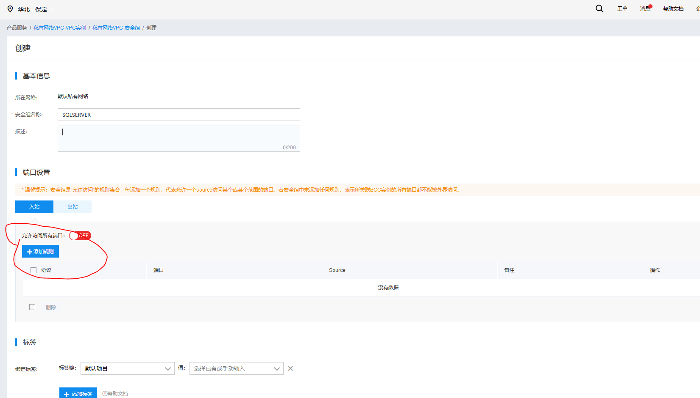

#### 配置sql server TCP/IP协议 

此处sqlserver 默认的1433已经存在模板可以直接使用，如想设置其他端口请自定义

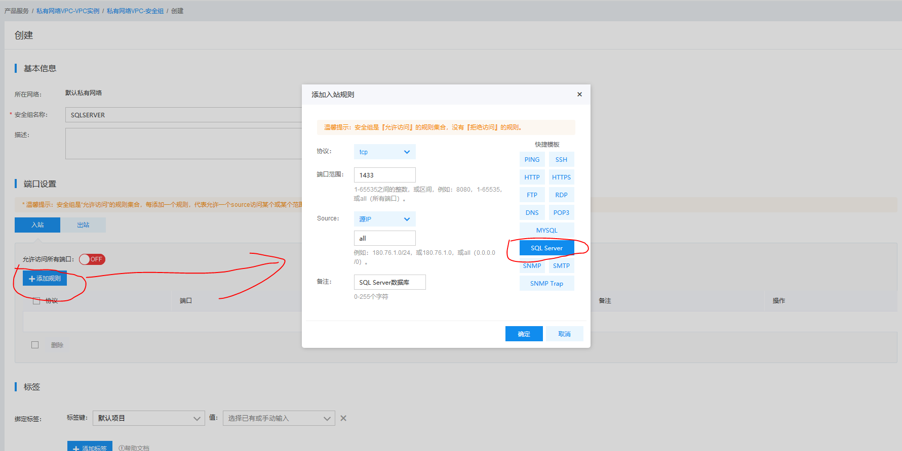

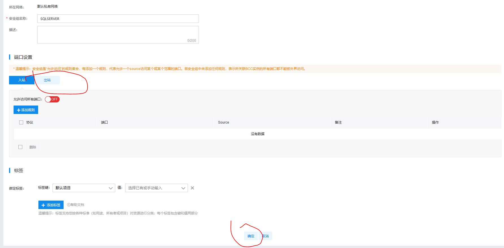

使用快捷键“windows+r”打开运行指令框。

在输入框中输入compmgmt.msc，

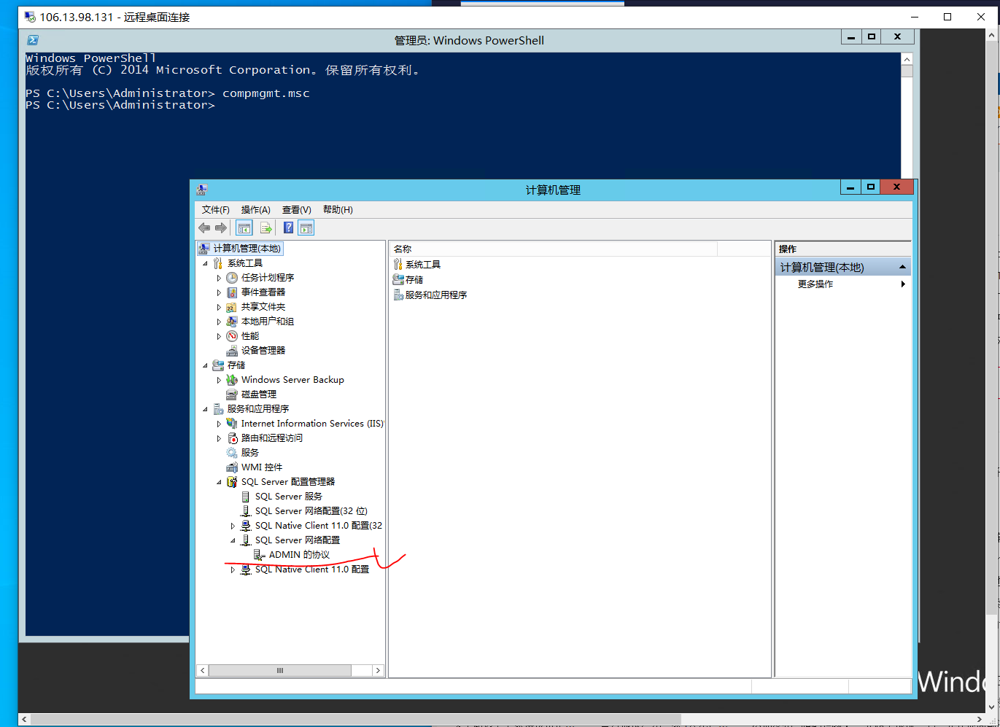

##### 点击TCP/IP协议

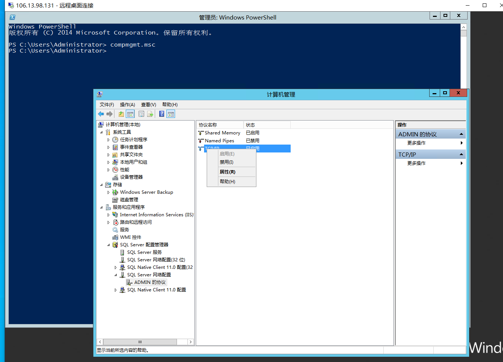

##### TCP端口设置

活动：是

已启用：是（选不了就不管他）

下面还有一个IPALL需要设置

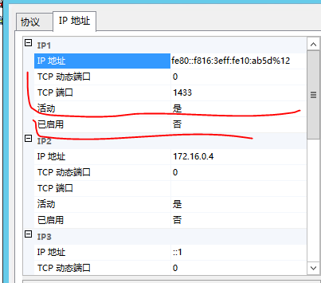

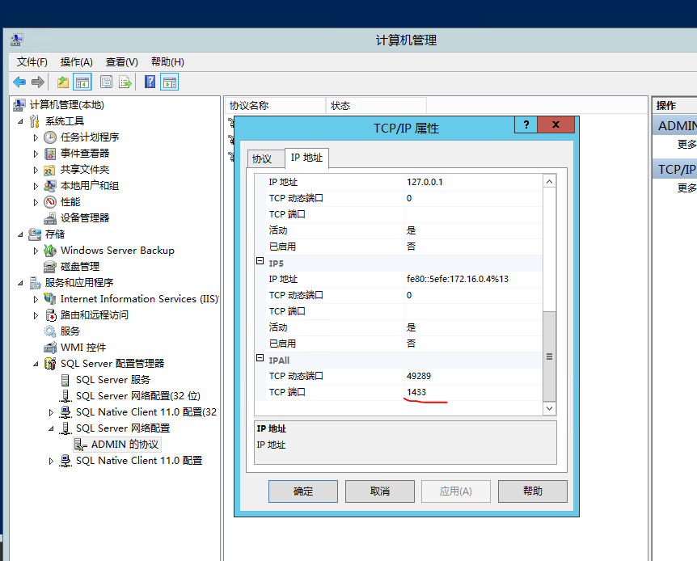

#### 配置电脑入站规则

需要添加两个入站规则

- 设置协议端口

  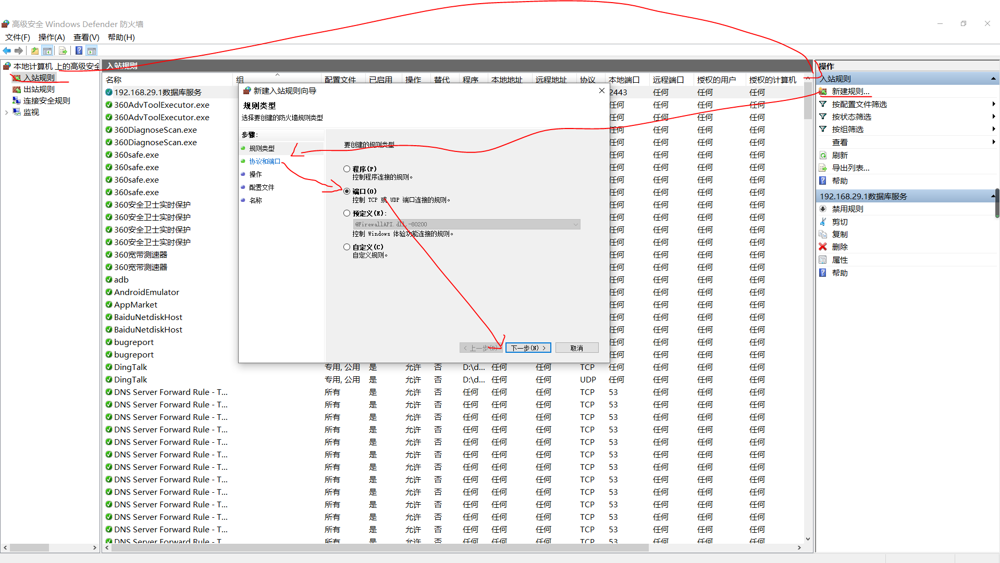

  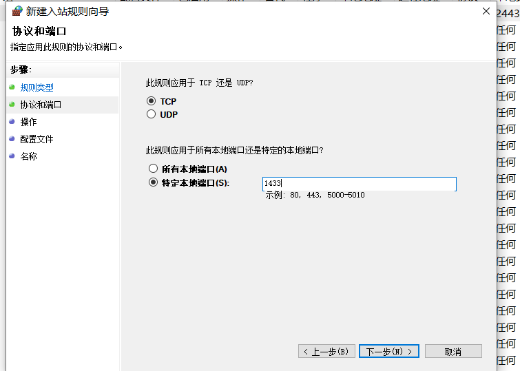

  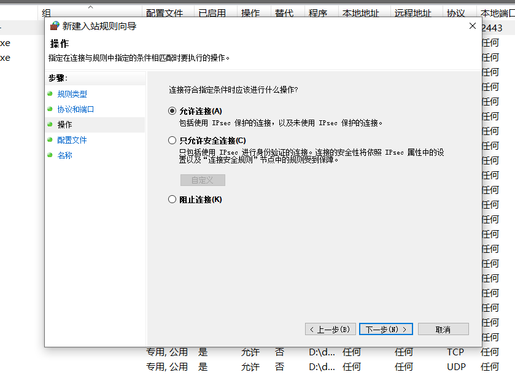

  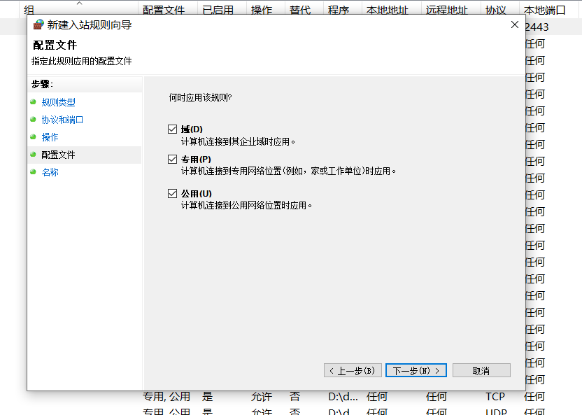

  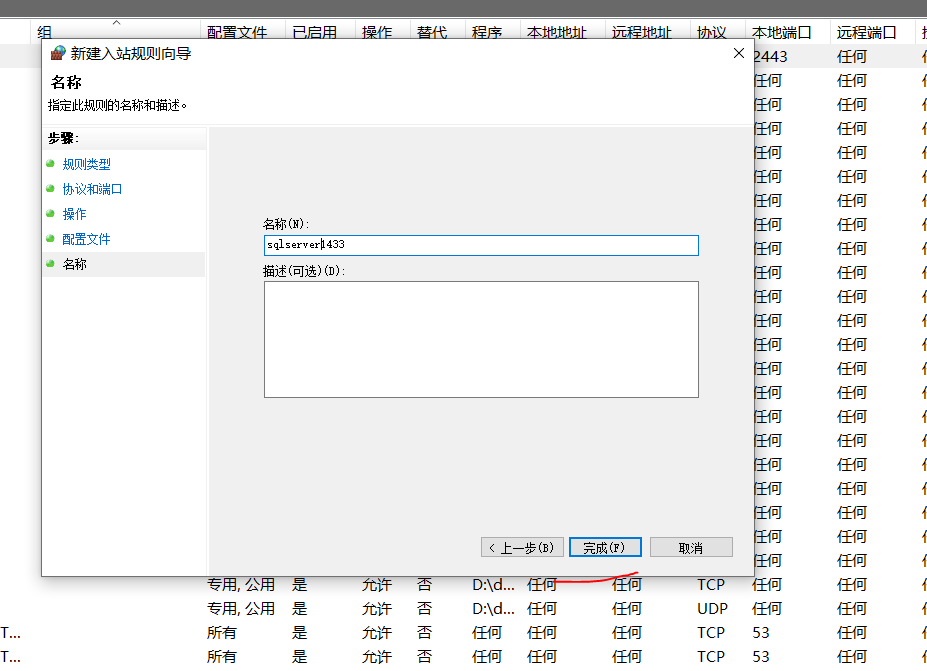

- 设置此规则匹配的完整路径和可执行程序

  C:\Program Files\Microsoft SQL Server\MSSQL11.MSSQLSERVER\MSSQL\Binn\sqlservr.exe（默认路径）

  MSSQL11.MSSQLSERVER指的是实例安装sql server时指定的有的人可能不一样

  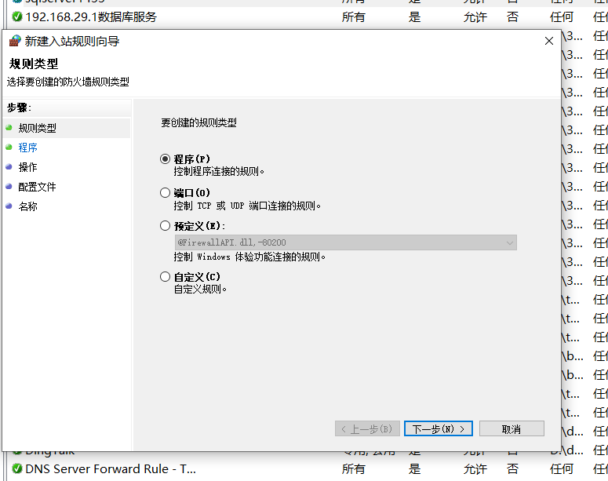

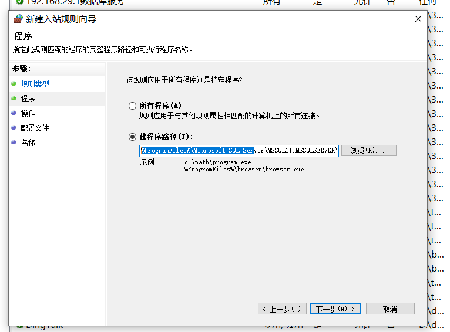


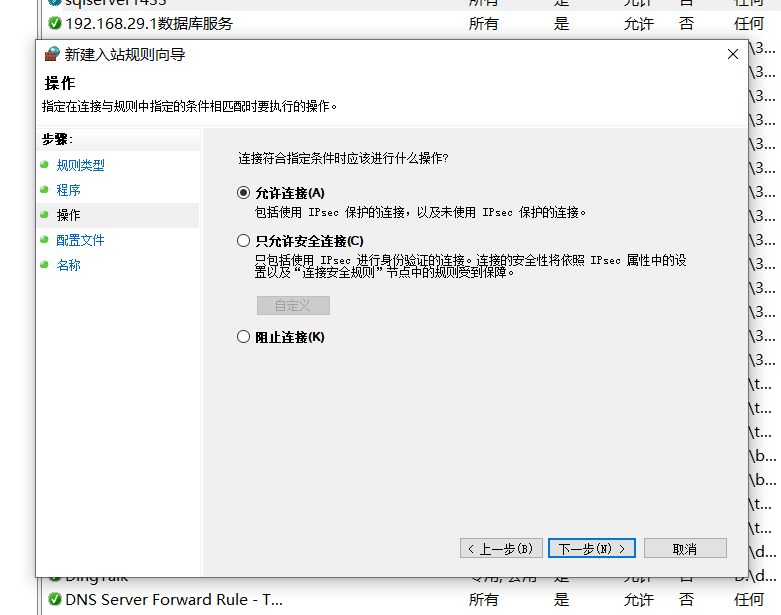

## 版本密钥

### 2012

- MICROSOFT SQL SERVER 2012 企业核心版激活码序列号: `FH666-Y346V-7XFQ3-V69JM-RHW28`

- MICROSOFT SQL SERVER 2012 商业智能版激活码序列号: `HRV7T-DVTM4-V6XG8-P36T4-MRYT6` 

- MICROSOFT SQL SERVER 2012 开发版激活码序列号: `YQWTX-G8T4R-QW4XX-BVH62-GP68Y` 

- MICROSOFT SQL SERVER 2012 企业server版/CAL版激活码序列号: `748RB-X4T6B-MRM7V-RTVFF-CHC8H`  

- MICROSOFT SQL SERVER 2012 标准版激活码序列号: `YFC4R-BRRWB-TVP9Y-6WJQ9-MCJQ7` 

- MICROSOFT SQL SERVER 2012 WEB版激活码序列号: `FB3W8-YRXDP-G8F8F-C46KG-Q998F`

## 数据类型

| 数据类型                                            | 范围                                                         | 介绍                                                         | SQL Server对数据类型使用以下优先顺序(用户定义的数据类型最高) | 存储                                     |
| --------------------------------------------------- | ------------------------------------------------------------ | ------------------------------------------------------------ | ------------------------------------------------------------ | ---------------------------------------- |
| bigint(长整型)                                      | -2^63 (-9,223,372,036,854,775,808)至 2^63-1 (9,223,372,036,854,775,807) |                                                              | 15                                                           | 8字节                                    |
| binary(50)(二进制)                                  |                                                              | 列数据条目的大小差异很大                                     | 30                                                           |                                          |
| bit(整数型)                                         | 1、0或NULL                                                   | 常用来存储boolean值(任何非0值结果皆为1)                      | 19                                                           |                                          |
| char(n)(字符数据类型)                               |                                                              | n定义字符串大小(以字节为单位)适用存储固定大小的值            | 28                                                           |                                          |
| date(时间类型)                                      | 2007-05-08                                                   |                                                              | 8                                                            |                                          |
| datetime(日期类型)                                  | 2007-05-08 12:35:29.123                                      |                                                              | 6                                                            |                                          |
| datetime2(7)(时间类型)                              | 2007-05-08 12:35:29. 1234567                                 |                                                              | 5                                                            |                                          |
| datetimeoffset(7)(时间类型)                         | 2007-05-08 12:35:29.1234567 +12:15                           |                                                              | 4                                                            |                                          |
| decimal(p, s)(具有固定精度和小数位数的数值数据类型) |                                                              | p(整数长度)s(小数长度)(s必须小于等于p,s>28会出现无法读取数据) | 12                                                           | 精度(p)/字节1~9/510~19/920~28/1329~38/17 |
| float[(n)](浮点型数据)                              | -1.79E + 308至-2.23E-308、0和2.23E-308至1.79E + 308          |                                                              | 10                                                           | 精度(n)/字节1~24/425~53/8                |
| geography(空间类型)                                 |                                                              | 地理                                                         |                                                              |                                          |
| geometry(空间类型)                                  |                                                              | 几何                                                         |                                                              |                                          |
| hierarchyid                                         |                                                              |                                                              |                                                              |                                          |
| image                                               | 0至2 ^ 31-1（2,147,483,647）                                 | 图片的二进制数据                                             | 22                                                           |                                          |
| int(整数型)                                         | -2^31 (-2,147,483,648) 至 2^31-1 (2,147,483,647)             |                                                              | 16                                                           | 4字节                                    |
| money                                               | -922,337,203,685,477.5808 至922,337,203,685,477.5807（仅支持两位小数） |                                                              | 13                                                           | 8字节                                    |
| nchar[(n)](字符数据类型)                            |                                                              | 固定大小的字符串数据。n以字节对的形式定义字符串大小，并且必须是1到4,000之间的值。存储大小是n字节的两倍 | 26                                                           |                                          |
| ntext                                               | 2 ^ 30-1（1,073,741,823）字节                                |                                                              | 20                                                           |                                          |
| numeric(18, 0)                                      |                                                              |                                                              |                                                              |                                          |
| nvarchar[(n)](字符数据类型)                         |                                                              | 可变大小的字符串数据。n以字节对的形式定义字符串大小，并且可以是1到4,000之间的值。max表示最大存储大小为2 ^ 30-1个字符（2 GB）。存储大小是n字节+ 2字节的两倍。对于[UCS-2](https://www.wikipedia.org/wiki/UTF-16#U+0000_to_U+D7FF_and_U+E000_to_U+FFFF)编码，存储大小为n字节+ 2字节的两倍，并且可以存储的字符数也为n。对于UTF-16编码，存储大小仍然是n字节+ 2字节的两倍，但是可以存储的字符数可能小于n因为补充字符使用两个字节对（也称为[替代对](https://www.wikipedia.org/wiki/UTF-16#U+010000_to_U+10FFFF)）。 | 25                                                           |                                          |
| nvarchar(MAX)                                       |                                                              | 25                                                           |                                                              |                                          |
| real                                                | - 3.40E + 38 to -1.18E - 38, 0 and 1.18E - 38 to 3.40E + 38  |                                                              | 11                                                           | 4字节                                    |
| smalldatetime(时间类型)                             |                                                              | 定义一个与一天中的某个时间结合的日期。时间基于一天的24小时制，秒始终为零（：00），且不包含小数秒。 | 7                                                            |                                          |
| smallint(短整型)                                    | -2^15 (-32,768) 至 2^15-1 (32,767)                           |                                                              | 17                                                           | 2字节                                    |
| smallmoney                                          | - 214,748.3648 至214,748.3647                                |                                                              | 14                                                           | 4字节                                    |
| sql_variant(数据类型)                               |                                                              | 用于存储各种SQL Server支持的数据类型的值                     | 2                                                            |                                          |
| text                                                | 2 ^ 31-1（2,147,483,647）                                    |                                                              | 21                                                           |                                          |
| time(7)(时间类型)                                   | 12:35:29. 1234567                                            |                                                              | 9                                                            |                                          |
| timestamp                                           | 二进制值                                                     | 将timestamp转换为十六进制或bigint进行查看                    | 23                                                           | 9字节                                    |
| tinyint(小整型)                                     | 0至255                                                       |                                                              | 18                                                           | 1字节                                    |
| uniqueidentifier                                    | 通过从格式为xxxxxxxx - xxxx - xxxx - xxxx - xxxxxxxxxxxx的字符串常量进行转换，其中每个x是0-9或af范围内的十六进制数字。例如，6F9619FF-8B86-D011-B42D-00C04FC964FF是有效的uniqueidentifier值。 | 16字节的GUID                                                 | 24                                                           |                                          |
| varbinary(50)(二进制)                               |                                                              | 列数据条目的大小是一致的                                     | 29                                                           |                                          |
| varbinary(MAX)(二进制)                              |                                                              | 列数据条目超过8,000个字节                                    | 29                                                           |                                          |
| varchar(50)(字符数据类型)                           |                                                              | n定义字符串大小(以字节为单位)适用存储可变大小的值            | 27                                                           |                                          |
| varchar(MAX)(字符数据类型)                          |                                                              | 字符类型容量最大                                             | 27                                                           |                                          |
| xml(xml数据类型)                                    |                                                              | xml实例存储在列中或xml类型的变量中                           | 3                                                            |                                          |

## DML

### 触发器

```sql
--触发器学习

--------------Insert-------------Update--------------------Detele----------
---Inserted---插入后该行的数据---更新后该行的数据（新数据）---不可用	    ---
---Deleted ---不可用         ---更新前该行的数据（旧数据）---删除前该行的数据---
----------------------------------------------------------------------------
--
--DML触发器
--
--表新增时触发

--判断是否存在名字为："tgr_bj_insert"的触发器，如果存在执行删除触发器
if ((object_id('tgr_bj_insert', 'TR') is not null))
    drop trigger tgr_bj_insert

--创建名为"tgr_bj_insert"
create trigger tgr_bj_insert
--作用表(作用域)
on bj
with encryption
--after 在insert、delete、update之后操作，
--insert of 替代触发器在执行是进行as部分判断
   after  insert 
as
    declare @calssid int,@name  nvarchar(50),@classname  nvarchar(50)
    select top 1 @calssid=id,@classname=name from bj order by id desc
	set @name='网警'
insert into emp (classid,name,classname) values (@calssid,@name,@classname)


--替代触发器
if ((object_id('tgr_bj_insertof', 'TR') is not null))
    drop trigger tgr_bj_insertof
	go
create trigger tgr_bj_insertof
--作用表(作用域)
on emp
 instead of update 
as
begin
 if (update(age))
	begin
	  declare	@age int,@id int
	  select @age= (select age from inserted)
	  select @id=(select id from inserted)
      if @age>100
      select '年龄不得大于100' as 错误信息
	  else
	  update  emp set age =@age where id=@id
	end
end
go


--表修改时触发
if ((object_id('tgr_bj_update', 'TR') is not null))
    drop trigger tgr_bj_update

go
CREATE TRIGGER tgr_bj_update
ON bj
after UPDATE
AS
IF UPDATE (name)
BEGIN
DECLARE @calssid VARCHAR (19)
SET @calssid = (
	SELECT
		d.id
	FROM
		deleted d,
		inserted i
	WHERE
		d.id = i.id
)
UPDATE stu
SET classname = (select  name from bj where id=@calssid ) 
WHERE
	classid = @calssid
END


--表删除时触发
if ((object_id('tgr_bj_delete', 'TR') is not null))
    drop trigger tgr_bj_delete
go
CREATE TRIGGER tgr_bj_delete 
ON bj  
after delete  
AS
DECLARE @calssid int
SET @calssid = (
	SELECT
		id
	FROM
		deleted ) 
delete from emp where classid=@calssid
go


--嵌套触发器
--最多嵌套32层
--禁用嵌套
exec sp_configure 'nested triggers',0
--启用嵌套
exec sp_configure 'nested triggers',0


--递归触发器
--直接递归
--间接递归

--
--DDL触发器
--
use db_Login
go
create trigger DenyDelete_Table
--作用域：database 默认当前数据库，当前服务器 all server 
on database           
with encryption
--事件名称：drop_table 删除事件,alter_table 修改事件
for drop_table,alter_table
as
begin
print '用户没有操作权限'
--rollback transaction  回滚操作
rollback transaction
end
go

--drop table emp

--触发器查看
--DML触发器：服务器》数据库》表》触发器
--DDL数据库触发器：服务器》数据库》可编程性》数据库触发器
--DDL服务器触发器：服务器》数据库》服务器对象》触发器
select * from sysobjects where xtype='TR'
sp_helptext  tgr_bj_update   --查看数据库信息
--修改触发器，语法跟创建触发器相同，除需要将create改alter
--删除触发器,drop trigger @触发器名称(名称可为数组进行多个触发器删除)
--删除服务器触发器 drop trigger @触发器名称 on all server
--禁用触发器
--disable trigger @触发器名称 on @作用域 
--启用触发器
--enabel trigger @触发器名称 on @作用域  
```

### 游标

```sql
DECLARE @username varchar(20),@UserId varchar(100)
DECLARE cursor_name CURSOR FOR --定义游标
    SELECT TOP 10 id,name FROM emp
    ORDER BY id DESC
OPEN cursor_name --打开游标
FETCH NEXT FROM cursor_name INTO  @UserId,@username  --抓取下一行游标数据
WHILE @@FETCH_STATUS = 0
    BEGIN
        PRINT '用户ID：'+@UserId+'            '+'用户名：'+@username
        FETCH NEXT FROM cursor_name INTO @UserId,@username
    END
CLOSE cursor_name --关闭游标
DEALLOCATE cursor_name --释放游标

go

--带SCROLL选项的游标
SET NOCOUNT ON
DECLARE C SCROLL CURSOR FOR  --SCORLL 后，有了更多的游标操作（滚动游标）
    SELECT TOP 10 id,name FROM emp
    ORDER BY id DESC
OPEN C 
FETCH LAST FROM C   --最后一行的数据，并将当前行为指定行
FETCH ABSOLUTE 4 FROM C  --从第一行开始的第4行数据，并将当前行为指定行  这里的n可正可负，n>0 往下翻，n<0 往上翻
FETCH RELATIVE 3 FROM C  --相对于当前行的后3行数据，并将当前行为指定行  这里的n可正可负
FETCH RELATIVE -2 FROM C --相对于当前行的前2行数据，并将当前行为指定行
FETCH PRIOR FROM C   ----相对于当前行的前1行数据
FETCH FIRST FROM C   --刚开始第一行的数据，并将当前行为指定行
FETCH NEXT FROM C   --相对于当前行的后1行数据

CLOSE C
DEALLOCATE C
```

### 视图

```sql
if OBJECT_ID('view_bjinfo','V') is not null
drop view view_bjinfo
go
create view view_bjinfo
as
select b.id,b.name as 班级名称,e.name,e.age from  emp e,bj b where e.classid=b.id
select*from view_bjinfo
```

### 事务

```sql
begin transaction
insert into emp (classid,name,classname,age) values ('24','jack','1703','10')
insert into emp (classid,name,classname,age) values ('24','jack','1703','10')
insert into emp (classid,name,classname,age) values ('24','jack','1703','10')
insert into emp (classid,name,classname,age) values ('24','jack','1703','10')
insert into emp (classid,name,classname,age) values ('24','jack','1703','10')
insert into emp (classid,name,classname,age) values ('24','jack','1703','10')
insert into emp (classid,name,classname,age) values ('24','jack','1703','10')
insert into emp (classid,name,classname,age) values ('24','jack','1703','10')
insert into emp (classid,name,classname,age) values ('24','jack','1703','10')
insert into emp (classid,name,classname,age) values ('24','jack','1703','10')
insert into emp (classid,name,classname,age) values ('24','jack','1703','10')
declare @count int
set @count= (select count(id) from emp)
if @count>10
begin
rollback transaction
print('插入数据太多')
end
else
begin
commit transaction
print('插入数据成功')
end
```


## DDL

## 内置方法

| 方法          |
| ------------- |
| object_id     |
| stuff         |
| convert       |
| substring     |
| exec          |
| sp_executesql |

## sql

SQLServer数据库查询带有某个字段的所有表名：

（1）精确查询语句如下：

SELECT [name] FROM [库名].[dbo].sysobjects WHERE id IN (SELECT id FROM [库名].[dbo].syscolumns WHERE name = '字段名')

（2）模糊匹配查询

SELECT [name] FROM [库名].[dbo].sysobjects WHERE id IN (SELECT id FROM [库名].[dbo].syscolumns WHERE name LIKE '%字段名%')

注：查询带有某个字段的所有表名

.

SELECT  CONVERT(varchar(100), 巡检日期, 23) AS create_date,min(巡检日期) AS min_date,max(巡检日期) as max_date 

FROM tb_zlb_xj

GROUP by CONVERT(varchar(100), 巡检日期, 23) 

ORDER BY  CONVERT(varchar(100), 巡检日期, 23) DESC

注：对时间进行查询，查询出表里每天第一个时间和最后一个时间

update tb_sbb_sbby_project set 资产细类=replace(资产细类,' ','')

注：替换字段中的字符,此处去掉字段中所有空格

select * from tb_sbb_sbby_project where charindex(' ',资产细类)>0

注：查询字符出现的数据

1.select * from tb_jhb_scjhb  where   SUBSTRING( CONVERT(nvarchar(20),开单日期,120),1,10)>='2019/10/1'  and SUBSTRING( CONVERT(nvarchar(20),开单日期,120),1,10)>='2019/10/31'

2.select * from tb_jhb_scjhb  where   CONVERT(nvarchar(20),开单日期,120)>='2019/10/1'  and CONVERT(nvarchar(20),开单日期,120)>='2019/10/31'

注：查询日期区间

SELECT s.name,a.name, b.rows

FROM sys.tables AS a 

INNER JOIN sysindexes AS b ON a.object_id = b.id

LEFT JOIN sys.schemas as s on a.schema_id = s.schema_id

WHERE (a.type = 'u') AND (b.indid IN (0, 1))

ORDER BY b.rows DESC

注：查询数据库每个表的行数

select * from openrowset('SQLOLEDB','therncway.net,3749';'iuser';'iuser',db_sczz.dbo.view_rsb_rsbaseinfo)

注：数据库跨库查询