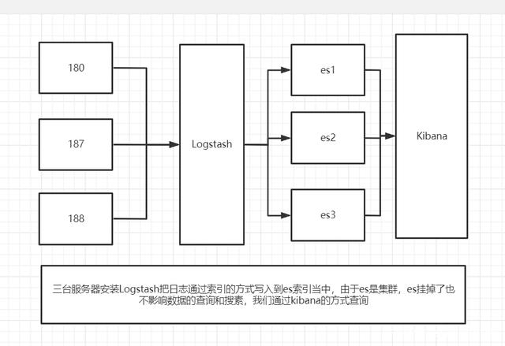

[TOC]

# 常见问题

## ssh无法链接

描述：`xftp` 无法与"`目标IP`"连接

原因：`OpenSSH`升级导致

解决办法：

1. 查看服务地址

   ```shell
   # 输入
   find / -name sftp-server
   # 结果
   /usr/local/openssh/libexec/sftp-server #像
   /home/EGS-B1101.17.1.211222/openssh8.8p1/openssh-8.8p1/sftp-server #不像
   ```

2. 设置正确的地址

   ```shell
   vim /etc/ssh/sshd_config
   ```

   查看`Subsystem`的值，比对第一步服务地址。

   修改正确的路径。

3. 重启

   ```shell
   systemctl restart sshd
   ```


## yum下载缓慢

安装yum-utils、lvm2

```
sudo yum install -y yum-utils \device-mapper-persistent-data \lvm2
```

设置包源

```
sudo yum-config-manager \
    --add-repo \
    https://download.docker.com/linux/centos/docker-ce.repo
```

官方：`https://download.docker.com/linux/centos/docker-ce.repo`

阿里云：`http://mirrors.aliyun.com/docker-ce/linux/centos/docker-ce.repo`

清华：`https://mirrors.tuna.tsinghua.edu.cn/docker-ce/linux/centos/docker-ce.repo`

# Docker使用

## 安装

```shell
sudo yum install docker-ce
```

## 启动

```shell
sudo systemctl start docker
```

## 验证

```shell
sudo docker version
```

## 常用命令

| 命令                                                         | 备注                         |
| ------------------------------------------------------------ | ---------------------------- |
| sudo systemctl start docker                                  | 启动docker                   |
| sudo systemctl stop docker                                   | 停止docker                   |
| sudo systemctl restart docker                                | 重启docker                   |
| sudo systemctl daemon-reload;sudo systemctl restart docker   | 重新加载配置文件，启动docker |
| docker rm 容器名称\容器ID                                    | 移除容器                     |
| docker stop 容器名称\容器ID                                  | 停止容器                     |
| docker rmi 镜像名称\镜像ID                                   | 移除镜像                     |
| docker build  -t 镜像名称 .                                  | 打包镜像                     |
| docker run  --rm --name 容器名称 -d -p 5555:80  镜像名称     | 构建容器                     |
| docker search 包名                                           | docker搜索                   |
| docker pull 包名:版本                                        | docker拉取                   |
| docker version                                               | docker版本                   |
| docker ps                                                    | 正在运行的容器               |
| docker images                                                | docker的镜像                 |
| docker exec -it -u root 容器名称 /bin/bash                   | 进入容器                     |
| docker --help                                                | docker帮助                   |
| docker info                                                  | docker信息                   |
| docker start 容器名称\容器ID                                 | 启动容器                     |
| docker stop 容器名称\容器ID                                  | 停止容器                     |
| docker restart 容器名称\容器ID                               | 重启容器                     |
| docker kill 容器名称\容器ID                                  | 强制停止容器                 |
| docker logs 容器名称\容器ID                                  | 查看容器日志                 |
| docker stop $(docker ps -a -q)                               | 停止所有容器                 |
| docker  rm $(docker ps -a -q)                                | 删除所有容器                 |
| docker update --restart=always 容器名称\容器ID               | 修改容器配置                 |
| [docker](https://so.csdn.net/so/search?q=docker&spm=1001.2101.3001.7020) rmi -f $(docker images -qa) | 删除所有镜像                 |
| docker network create newnetwork                             | docker创建网络环境           |
| docker network rm newnetwork                                 | docker删除网络环境           |
| docker network ls                                            | docker网络环境列表           |
| docker run -v [本地文件路径]:[容器文件路径]                  | docker 卷的映射，数据持久化  |

## docker构建容器

### jenkins 安装

#### 拉取镜像

```shell
docker pull jenkins/jenkins:lts
```

#### 构建容器

创建文件夹存储数据

```
mkdir /data/jenkins_home
```

给文件夹授权

```
chmod 777 /data/jenkins_home
```

一定要映射到卷，不然后面无法使用docker命令

```shell
docker run -d --name jenkins -p 8081:8080 -v /var/run/docker.sock:/var/run/docker.sock -v $(which docker):/bin/docker -v /data/jenkins_home:/var/jenkins_home -d jenkins/jenkins:lts
```

#### 查看jenkins密码

```shell
# 查看容器
docker ps -a
# 进入容器
docker exec -u 0 -it 21ee4816aac1 /bin/bash
# 查看指定文件内容
cat /var/jenkins_home/secrets/initialAdminPassword #密码
```

#### 使用

第一次运行成功，后续无法启动，状态显示Exited，需要设置文件夹权限，获取到Jenkins的uid，进行赋权

```
sudo chown 1000:1000 /data/jenkins_home
```

虽然映射到卷，jenkis使用docker可以，但是其他docker 命令不行。还需要将当前用户添加到用户组

```shell
# 添加用户组
groupadd docker
# 添加用户到用户组(root:根据实际场景)
sudo usermod -a -G docker root
# 上面类容还不行，就修改文件权限
cd /var/run
# 允许读写和执行
chmod 777 docker.sock
```

jenkins执行shell只执行第一句

```
# shell 第一句加上这个，指定解释器，下面"#"非注释，也可#!/bin/sh
#!/bin/bash
```

时区不对

```shell
# 修复Linux时区，查看上海时区
# 输入
timedatectl list-timezones |grep Shanghai
# 输出
Asia/Shanghai
# 修改时区
timedatectl set-timezone Asia/Shanghai
# 修复jenkins时区
docker exec -it -u root my_jenkins /bin/bash
cp /usr/share/zoneinfo/Asia/Shanghai /etc/localtime
echo Asia/Shanghai > /etc/timezone
# 站点重启
http://localhost:8080/restart
```

到此时间格式是改变了，还有其他细节上的时间没有改过来少8个小时。在jenkins上`系统管理》脚本命令行`运行

```shell
System.setProperty('org.apache.commons.jelly.tags.fmt.timeZone', 'Asia/Shanghai')
```

#### 自动化部署.net core

```shell
#!/bin/bash
docker stop xblogs_api
docker rm xblogs_api
docker rmi xblogs_api
cp src/xblogs.HttpApi.Host/Dockerfile $PWD
docker build -t xblogs_api .
docker run -v /root/data:/app/inetpub --name xblogs_api -d -p 2022:80 --restart=always xblogs_api 
```


### mysql 安装

#### 拉取镜像

```shell
docker pull mysql:5.7
```

#### 构建容器

```shell
docker run --restart=always -d -p 3306:3306 --privileged=true -v /docker/mysql/conf/my.cnf:/etc/my.cnf -v /docker/mysql/data:/var/lib/mysql -e MYSQL_ROOT_PASSWORD=123456 --name mysql mysql:5.7 --character-set-server=utf8mb4 --collation-server=utf8mb4_general_ci
```

#### 修改密码

```shell
# 进入容器
docker exec -it mysql bash
# 登录mysql
mysql -uroot -p
# 输入密码后, 执行下面命令创建新用户 (用户名: root , 密码: 123456)
GRANT ALL PRIVILEGES ON *.* TO 'root'@'%' IDENTIFIED BY '123456' WITH GRANT OPTION;
GRANT ALL PRIVILEGES ON *.* TO 'root'@'%' IDENTIFIED BY 'Wxh623059..' WITH GRANT OPTION;
```

#### 版本升级

与普通安装相似，需要先暂停原有的mysql容器，记得先备份。然后拉取新版本mysql,运行修改密码。然后重启。原来旧版本的mysql镜像可以删除。

### ELK 安装



#### Elasticsearch

[下载地址/文档](https://www.elastic.co/cn/downloads/elasticsearch)

```
docker pull docker.elastic.co/elasticsearch/elasticsearch:8.0.0
```


> 从Elasticsearch 8.0开始，默认启用安全性。启用安全保护后，弹性堆栈安全功能要求对传输网络层进行TLS加密，否则您的群集将无法启动。

1. 为Elasticsearch和Kibana创建一个新的docker网络

   ```
   docker network create elastic
   ```

   

2. 在Docker中启动Elasticsearch。为生成一个密码弹性的用户和终端的输出，以及用于注册Kibana的注册令牌。

   ```
   docker run --restart=always -d --name es01 --net elastic -p 9200:9200 -p 9300:9300 -it docker.elastic.co/elasticsearch/elasticsearch:8.0.0
   ```

   

3. 复制生成的密码和注册令牌，并将其保存在安全位置。这些值仅在首次启动Elasticsearch时显示。

   ```
   -> Elasticsearch security features have been automatically configured!
   -> Authentication is enabled and cluster connections are encrypted.
   
   # 账号：elastic；初始密码：+x96YH3NDGmxG-aQ4M8P；重置密码命令：bin/elasticsearch-reset-password -u elastic
   ->  Password for the elastic user (reset with `bin/elasticsearch-reset-password -u elastic`):
     +x96YH3NDGmxG-aQ4M8P
   
   # ca证书密钥：41696e2dd0dca56e7b74b06bf5b2e002b77bce150d68915a0dbb936124530f79
   ->  HTTP CA certificate SHA-256 fingerprint:
     41696e2dd0dca56e7b74b06bf5b2e002b77bce150d68915a0dbb936124530f79
   
   # kibana初始化注册密钥：
   eyJ2ZXIiOiI4LjEuMiIsImFkciI6WyIxNzIuMTguMC4yOjkyMDAiXSwiZmdyIjoiNDE2OTZlMmRkMGRjYTU2ZTdiNzRiMDZiZjViMmUwMDJiNzdiY2UxNTBkNjg5MTVhMGRiYjkzNjEyNDUzMGY3OSIsImtleSI6IlJJN3pEWUFCYVlPRkpUUmxpNkhSOk9yWkJqc0gxU2txRmRmVmVrMFdYd1EifQ==
   ->  Configure Kibana to use this cluster:
   * Run Kibana and click the configuration link in the terminal when Kibana starts.
   * Copy the following enrollment token and paste it into Kibana in your browser (valid for the next 30 minutes):
     eyJ2ZXIiOiI4LjEuMiIsImFkciI6WyIxNzIuMTguMC4yOjkyMDAiXSwiZmdyIjoiNDE2OTZlMmRkMGRjYTU2ZTdiNzRiMDZiZjViMmUwMDJiNzdiY2UxNTBkNjg5MTVhMGRiYjkzNjEyNDUzMGY3OSIsImtleSI6IlJJN3pEWUFCYVlPRkpUUmxpNkhSOk9yWkJqc0gxU2txRmRmVmVrMFdYd1EifQ==
   
   -> Configure other nodes to join this cluster:
   * Copy the following enrollment token and start new Elasticsearch nodes with `bin/elasticsearch --enrollment-token <token>` (valid for the next 30 minutes):
     eyJ2ZXIiOiI4LjEuMiIsImFkciI6WyIxNzIuMTguMC4yOjkyMDAiXSwiZmdyIjoiNDE2OTZlMmRkMGRjYTU2ZTdiNzRiMDZiZjViMmUwMDJiNzdiY2UxNTBkNjg5MTVhMGRiYjkzNjEyNDUzMGY3OSIsImtleSI6IlFvN3pEWUFCYVlPRkpUUmxpNkhMOlMzYzVYdWExUkkyWFUtdFZ4U0tENlEifQ==
   
     If you're running in Docker, copy the enrollment token and run:
     `docker run -e "ENROLLMENT_TOKEN=<token>" docker.elastic.co/elasticsearch/elasticsearch:8.1.2`
   
   ```

   1. 如果您需要重置的密码`弹性的`用户或其他内置用户，运行[`弹性搜索-重置-密码`](https://www.elastic.co/guide/en/elasticsearch/reference/current/reset-password.html)工具。该工具在弹性搜索中可用`/bin`Docker容器的目录。例如

      ```
      docker exec -it es01 /usr/share/elasticsearch/bin/elasticsearch-reset-password -u elastic
      # Password for the [elastic] user successfully reset.
      # New value: 4GlsHFPF1kbh8_i4*A3I
      ```

      

4. 复制`http_ca.crt`从Docker容器到本地机器的安全证书。

   ```
   docker cp es01:/usr/share/elasticsearch/config/certs/http_ca.crt .
   ```

   

5. 打开一个新的终端，使用`http_ca.crt`从Docker容器中复制的文件。输入的密码`弹性的`出现提示时的用户。

   ```
   curl --cacert http_ca.crt -u elastic https://localhost:9200
   ```

   

6. **生成注册令牌**

   注册令牌的有效期为30分钟。如果需要生成新的注册令牌，请运行[`弹性搜索-创建-注册-令牌`](https://www.elastic.co/guide/en/elasticsearch/reference/current/create-enrollment-token.html)现有节点上的工具。该工具在弹性搜索中可用`容器`docker容器的目录。

   例如，在现有的上运行以下命令`es01`为新的弹性搜索节点生成注册令牌的节点:

   ```
   docker exec -it es01 /usr/share/elasticsearch/bin/elasticsearch-create-enrollment-token -s node
   
   # eyJ2ZXIiOiI4LjEuMiIsImFkciI6WyIxNzIuMTguMC4yOjkyMDAiXSwiZmdyIjoiNDE2OTZlMmRkMGRjYTU2ZTdiNzRiMDZiZjViMmUwMDJiNzdiY2UxNTBkNjg5MTVhMGRiYjkzNjEyNDUzMGY3OSIsImtleSI6IklfQzhEb0FCWmlRQnRCNGFiLVRuOnlwMzZET0Y0VHAtNzd1SC1yMUYzbGcifQ==
   
   ```

   

7. 在启动第一个节点的终端中，复制generatedenrollment令牌以添加新的Elasticsearch节点。在您的新节点上，启动Elasticsearch并包含生成的注册令牌。

   ```
   docker run -e ENROLLMENT_TOKEN="<token>" --name es02 --net elastic -it docker.elastic.co/elasticsearch/elasticsearch:8.1.2
   
   # docker run -e ENROLLMENT_TOKEN="eyJ2ZXIiOiI4LjEuMiIsImFkciI6WyIxNzIuMTguMC4yOjkyMDAiXSwiZmdyIjoiNDE2OTZlMmRkMGRjYTU2ZTdiNzRiMDZiZjViMmUwMDJiNzdiY2UxNTBkNjg5MTVhMGRiYjkzNjEyNDUzMGY3OSIsImtleSI6IklmQUpEb0FCWmlRQnRCNGFKdVQ2OlUwODhtejV2U0EtaWowaGlHRVRkOGcifQ==" --name es02 --net elastic -it docker.elastic.co/elasticsearch/elasticsearch:8.1.2
   # 如果失败可能是内存溢出
   ```

#### Logstash

https://www.cnblogs.com/linjiqin/p/12103645.html

#### Kibana

```
docker pull kibana:8.0.0
```

文档地址

https://blog.csdn.net/UbuntuTouch/article/details/122936411?ops_request_misc=%257B%2522request%255Fid%2522%253A%2522164959816216781683947810%2522%252C%2522scm%2522%253A%252220140713.130102334.pc%255Fblog.%2522%257D&request_id=164959816216781683947810&biz_id=0&utm_medium=distribute.pc_search_result.none-task-blog-2~blog~first_rank_ecpm_v1~rank_v31_ecpm-10-122936411.nonecase&utm_term=%E5%AE%89%E8%A3%85&spm=1018.2226.3001.4450

#### 解决问题

vi/vim：容器内无法使用

```
docker exec -it -u 0 容器名称/id /bin/bash
apt-get update
apt-get install vim*
```

> apt-get 在容器内会提示一个路径错误。是因为权限不足。在进入容器时声明权限`-u 0`使用root权限进入。
>
> *apt-get*，是一条linux命令，适用于deb包管理式的操作系统，主要用于自动从互联网的软件仓库中搜索、安装、升级、卸载软件或操作系统。
>
> 此处可以理解centos 使用 yum 安装软件。Ubuntu 使用 apt-get。但是Linux环境下的docker是使用apt-get。包管理跟操作系统无关。

### .net core 项目部署(一)

> 此示例是个人项目，常见情况。

#### 拉取镜像

```shell
docker pull mcr.microsoft.com/dotnet/sdk:5.0
```

#### 验证

```shell
# 输入
docker images
# 结果
mcr.microsoft.com/dotnet/sdk     5.0
mcr.microsoft.com/dotnet/aspnet  5.0
```

#### 创建doccker配置文件

`Visual Studio`右键项目创建`Docker`支持

#### 打包项目镜像

- 使用Dockerfile打包镜像

  ```shell
  # 当前文件夹打包镜像
  docker build -t 镜像名称 .
  # 当前文件夹使用指定文件打包镜像
  docker build -f xxx/Dockerfile -t 镜像名称 .
  ```

#### 构建容器

```shell
docker run --name 容器名称 -p 2022:80 --restart=always 镜像名称
```

#### 解决问题

##### System.Drawing 兼容问题

###### 验证码不显示

修改Dockerfile

```shell
# 更新包
RUN apt-get update
# 安装apt-get 安装 libc6-dev , libgdiplus  用于支持system.drawing 组件绘制,默认ubuntu命令
#RUN apt-get update && apt-get install -y apt-utils libgdiplus libc6-dev
# 配置apt的资源，采用阿里云资源仓库 必须是debian 10 buster版本
RUN mv /etc/apt/sources.list /etc/apt/sources.list.bak && \
   echo "deb http://mirrors.aliyun.com/debian/ buster main non-free contrib" >/etc/apt/sources.list && \
   echo "deb-src http://mirrors.aliyun.com/debian/ buster main non-free contrib" >>/etc/apt/sources.list && \
   echo "deb http://mirrors.aliyun.com/debian-security buster/updates main" >>/etc/apt/sources.list && \
   echo "deb-src http://mirrors.aliyun.com/debian-security buster/updates main" >>/etc/apt/sources.list && \
   echo "deb http://mirrors.aliyun.com/debian/ buster-updates main non-free contrib" >>/etc/apt/sources.list && \
   echo "deb-src http://mirrors.aliyun.com/debian/ buster-updates main non-free contrib" >>/etc/apt/sources.list && \
   echo "deb http://mirrors.aliyun.com/debian/ buster-backports main non-free contrib" >>/etc/apt/sources.list && \
   echo "deb-src http://mirrors.aliyun.com/debian/ buster-backports main non-free contrib" >>/etc/apt/sources.list
RUN  apt-get update && apt-get install -y apt-utils libgdiplus libc6-dev
```

##### Dockerfiled修改

> 当前项目后期我们进行的大范围改动，包括项目文件夹的移动、使用封装之后通用类库的Nuget包。
>
> 过程中发我使用jenkins发现。无法使用原有dockerfile进行安装。我对dockerfile进行了修改。

###### 文件路径修改

见下面

###### 指定Nuget 包源

```dockerfile
# 指定项目基于什么框架
FROM mcr.microsoft.com/dotnet/aspnet:5.0 AS base
# 更新apt-ger
RUN apt-get update
# 设置包源
RUN mv /etc/apt/sources.list /etc/apt/sources.list.bak && \
   echo "deb http://mirrors.aliyun.com/debian/ buster main non-free contrib" >/etc/apt/sources.list && \
   echo "deb-src http://mirrors.aliyun.com/debian/ buster main non-free contrib" >>/etc/apt/sources.list && \
   echo "deb http://mirrors.aliyun.com/debian-security buster/updates main" >>/etc/apt/sources.list && \
   echo "deb-src http://mirrors.aliyun.com/debian-security buster/updates main" >>/etc/apt/sources.list && \
   echo "deb http://mirrors.aliyun.com/debian/ buster-updates main non-free contrib" >>/etc/apt/sources.list && \
   echo "deb-src http://mirrors.aliyun.com/debian/ buster-updates main non-free contrib" >>/etc/apt/sources.list && \
   echo "deb http://mirrors.aliyun.com/debian/ buster-backports main non-free contrib" >>/etc/apt/sources.list && \
   echo "deb-src http://mirrors.aliyun.com/debian/ buster-backports main non-free contrib" >>/etc/apt/sources.list
# 安装库，此处是支持gdip
RUN  apt-get update && apt-get install -y apt-utils libgdiplus libc6-dev
# 进入指定目录
WORKDIR /app
# 指定端口
EXPOSE 80
# 指定基于5.0生成
FROM mcr.microsoft.com/dotnet/sdk:5.0 AS build
WORKDIR /src
# 此处复制相关项目的依赖，如果项目后期改动，会导致后期打包失败，项目目录根据实际情况来
COPY ["Property/ShuWen.Property/ShuWen.Property.csproj", "Property/ShuWen.Property/"]
COPY ["Property/ShuWen.Property/nuget.config", "Property/ShuWen.Property/"]
COPY ["src/WalkingTec.Mvvm.TagHelpers.LayUI/WalkingTec.Mvvm.TagHelpers.LayUI.csproj", "src/WalkingTec.Mvvm.TagHelpers.LayUI/"]
COPY ["src/WalkingTec.Mvvm.Core/WalkingTec.Mvvm.Core.csproj", "src/WalkingTec.Mvvm.Core/"]
COPY ["src/WalkingTec.Mvvm.Mvc/WalkingTec.Mvvm.Mvc.csproj", "src/WalkingTec.Mvvm.Mvc/"]
COPY ["Common/ShuWen.Common.csproj", "Common/"]
COPY ["ShuWen.Property.DataAccess/ShuWen.Property.DataAccess.csproj", "ShuWen.Property.DataAccess/"]
COPY ["ShuWen.Property.Model/ShuWen.Property.Model.csproj", "ShuWen.Property.Model/"]
COPY ["Property/ShuWen.Property.ViewModel/ShuWen.Property.ViewModel.csproj", "Property/ShuWen.Property.ViewModel/"]
# 此步跟启动vs项目前的生成或者第一次打开项目生成项目很像nuget包还原。实际也做得是nuget包还原。此处需要指定包源。我的包源写在nuget.config中
RUN dotnet restore "Property/ShuWen.Property/ShuWen.Property.csproj"  --configfile "Property/ShuWen.Property/nuget.config"
COPY . .
WORKDIR "Property/ShuWen.Property/"
# 对项目进行打包
RUN dotnet build "ShuWen.Property.csproj" -c Release -o /app/build
FROM build AS publish
# 发布项目
RUN dotnet publish "ShuWen.Property.csproj" -c Release -o /app/publish
FROM base AS final
WORKDIR /app
# 将项目复制到指定的文件夹
COPY --from=publish /app/publish .
# 运行项目
ENTRYPOINT ["dotnet", "ShuWen.Property.dll"]
```

nuget.config 内容：

```xml
<?xml version="1.0" encoding="utf-8"?>
<configuration>
	<packageSources>
		<add key="Nuget.org" value="https://api.nuget.org/v3/index.json" />
		<add key="Baget" value="http://47.100.94.46:5555/v3/index.json" />
	</packageSources>
</configuration>
```


### .net core 项目部署(二)

> 私有化NuGet

#### 创建项目配置文件

项目的根目录创建`baget.env`文件，文件内容如下

```nginx
# 以下配置是用于发布包的 API Key。
# 你应该把它改成一个秘密值来保护你的服务器。
ApiKey=你的秘钥

#文件存储方式和路径
Storage__Type=FileSystem
Storage__Path=/var/baget/packages

#数据存储的方式和路径，此处配置要和appsettings.json一致
#Database__Type=Sqlite
#Database__ConnectionString=Data Source=/var/baget/baget.db
Database__Type=MySql
Database__ConnectionString=Server=127.0.0.1;Database=BaGet;Uid=root;Pwd=123456;

#查询的类型
Search__Type=Database
```

#### 打包

```shell
docker build  -t baget .
```

#### 运行

```shell
docker run  --rm --name baget -d -p 5555:80 --env-file baget.env -v "$(pwd)/baget-data:/var/baget" loicsharma/baget:latest
```

#### 注意

1. 下面三处的`ApiKey`需要一致

- 代码工程的`appsettings.json`的`ApiKey`
- `baget.env`文件`ApiKey`
- 上传包`--api-key`

1. 数据存储方式配置一致
   `baget.env`文件要和appsettings.json一致

#### NuGet

##### 上传

```shell
# 进入nupkg所在文件夹，使用命令行。
dotnet nuget push -s http://47.100.94.46:5555/v3/index.json XXX.nupkg -k apiKey
```

##### 删除

```shell
dotnet nuget delete ShuWen.Common 1.0.0 --non-interactive -s http://47.100.94.46:5555/v3/index.json -k shuwenNuGet
```

> 编辑：配置nupkg版本和其他信息使用`NuGetPackageExplorer`工具

##### git仓库地址

```shell
# NuGetPackageExplorer编辑器代码仓库
https://github.com/NuGetPackageExplorer/NuGetPackageExplorer.git
# BaGet代码仓库
https://github.com/loic-sharma/BaGet.git
```

##### 设置visual studio包源

```shell
# 命令行,设置完成之后重启
dotnet nuget add source http://47.100.94.46:5555/v3/index.json -n name_xx
```

##### 批处理上传

将所有的nupkg放在同一的文件夹下，新建bat文件，复制下面内容运行根据自己的地址进行修改。

```bash
:: close echo
@echo off
:: init params
set url=http://47.100.94.46:5555/v3/index.json
set deployFile=*.nupkg
set apikey=shuwenNuGet
echo Searching nupkg file...
rem 启用"延缓环境变量扩充"
SETLOCAL ENABLEDELAYEDEXPANSION
for %%f in (%deployFile%) do (
   set name=%%f
   echo !name! to deploy to %url%
   rem deploy to server
   dotnet nuget push -s %url%  !name!  -k %apikey%
)

pause
```


# 其他

## Linux 命令

[https://www.linuxcool.com/]: 

