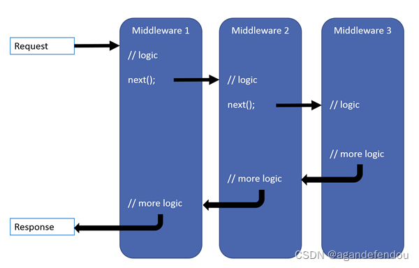

##### 日志

命名空间：[Microsoft.Extensions.Logging](https://docs.microsoft.com/zh-cn/dotnet/api/microsoft.extensions.logging?view=dotnet-plat-ext-6.0&viewFallbackFrom=net-6.0)

> 他们的关系是先由ILoggingBuilder配置日志程序,ILoggerFactory 根据日志类型（categoryName）调用 对应的 ILoggerProvider 获取 ILogger

[ILogger](https://docs.microsoft.com/zh-cn/dotnet/api/microsoft.extensions.logging.ilogger?view=dotnet-plat-ext-6.0)

[ILoggerProvider](https://docs.microsoft.com/zh-cn/dotnet/api/microsoft.extensions.logging.iloggerprovider?view=dotnet-plat-ext-6.0)

[ILoggerFactory](https://docs.microsoft.com/zh-cn/dotnet/api/microsoft.extensions.logging.iloggerfactory?view=dotnet-plat-ext-6.0)

[ILoggingBuilder](https://docs.microsoft.com/zh-cn/dotnet/api/microsoft.extensions.logging.iloggingbuilder?view=dotnet-plat-ext-6.0)

##### 过滤器（过滤器管道）

> 过滤器也是一种特殊的管道

命名空间：[Microsoft.AspNetCore.Mvc.Filters](https://docs.microsoft.com/zh-cn/dotnet/api/microsoft.aspnetcore.mvc.filters?view=aspnetcore-6.0)

> OnAuthorization→OnResourceExecuting→创建控制器→OnActionExecuting→执行action业务→OnActionExecuted→OnResultExecuting→页面渲染加载→OnResultExecuted→OnResourceExecuted（不包括异常过滤器的情况下）

[IAuthorizationFilter](https://docs.microsoft.com/zh-cn/dotnet/api/microsoft.aspnetcore.mvc.filters.iauthorizationfilter?view=aspnetcore-6.0)

[IResourceFilter](https://docs.microsoft.com/zh-cn/dotnet/api/microsoft.aspnetcore.mvc.filters.iresourcefilter?view=aspnetcore-6.0)

[IActionFilter](https://docs.microsoft.com/zh-cn/dotnet/api/microsoft.aspnetcore.mvc.filters.iactionfilter?view=aspnetcore-6.0)

[IResultFilter](https://docs.microsoft.com/zh-cn/dotnet/api/microsoft.aspnetcore.mvc.filters.iresultfilter?view=aspnetcore-6.0)

[IExceptionFilter](https://docs.microsoft.com/zh-cn/dotnet/api/microsoft.aspnetcore.mvc.filters.iexceptionfilter?view=aspnetcore-6.0)

